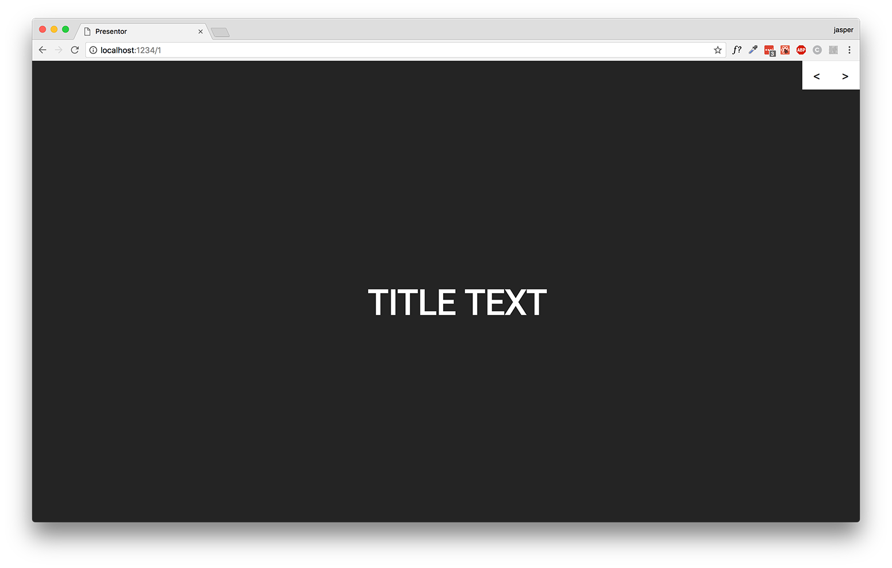

# Presentor-framework

A framework for creating slideshows using parcel, markdown and react.

## Why

Some reasons why I've created this framework:

* React is just way cooler than keynote
* Nice to have a re-usable webapp for creating slideshows
* Styling is simply way easier using styled-components or css than using something like keynote
* Way easier to share and view from any computer or device