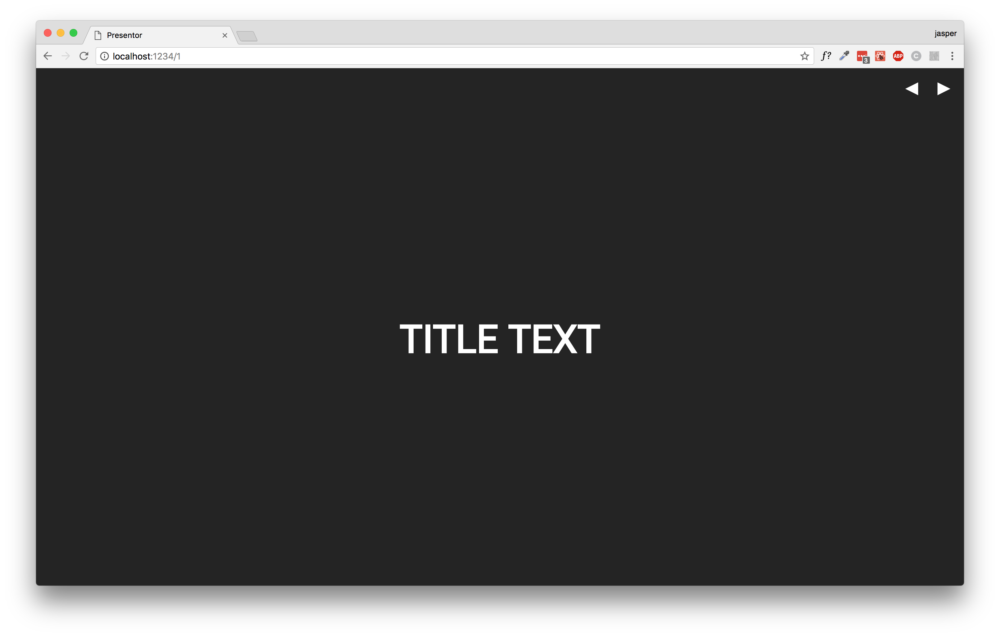

# Presentor

A template for creating slideshows using parcel and react.

## Features

* Navigate using keys (arrow/space)
* Navigate using buttons
* Pre-styled template
* Routing

## Getting started

### Creating a Slide

Create a react component, you can find examples on every template inside `/src/components/slides`, these are the demo slides.

### Naming

For the best result name your slide files according to this naming convention: `Slide{SlideID}.js`

## Why

Some reasons why I've created this framework:

* React is just way cooler than keynote
* Nice to have a re-usable webapp for creating slideshows
* Styling is simply way easier using styled-components or css than using something like keynote
* Way easier to share and view from any computer or device